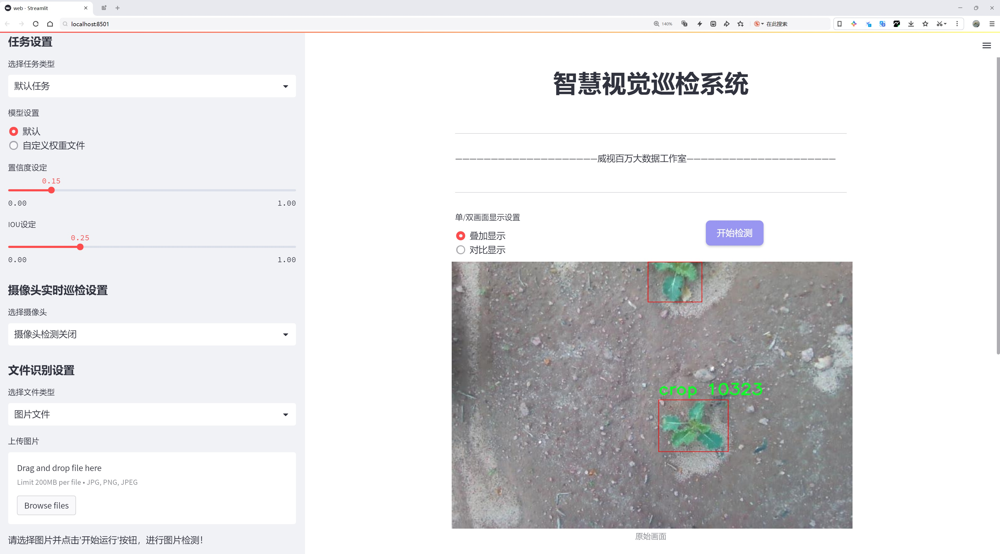
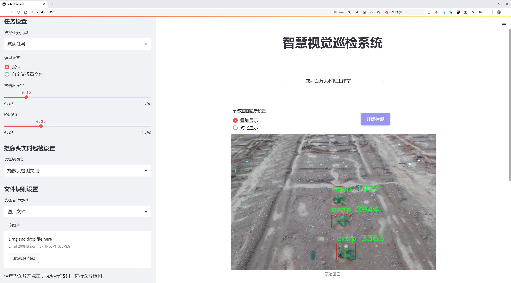
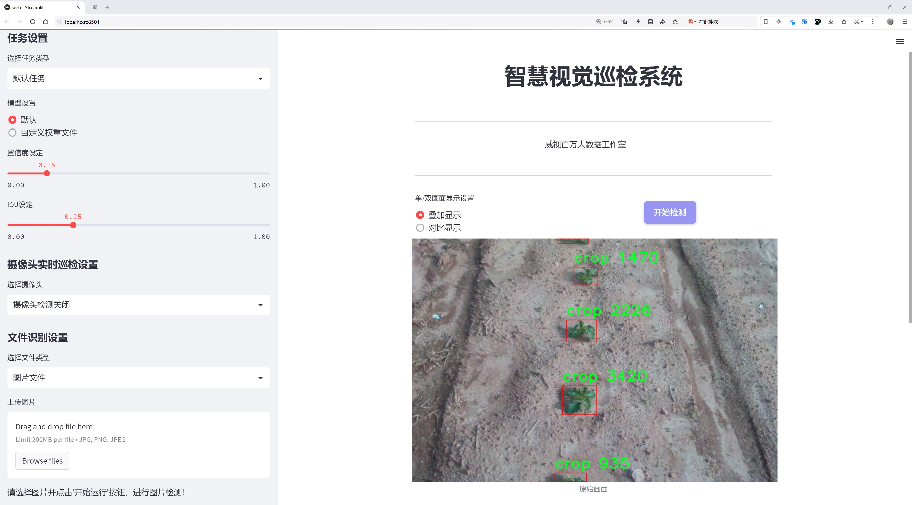
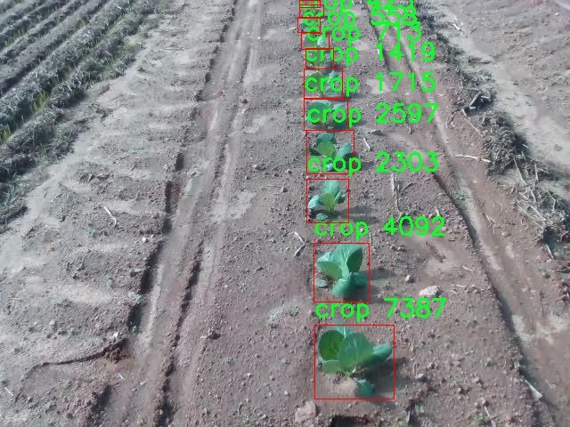
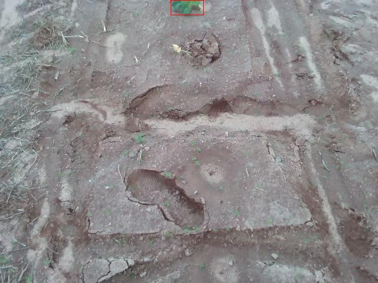
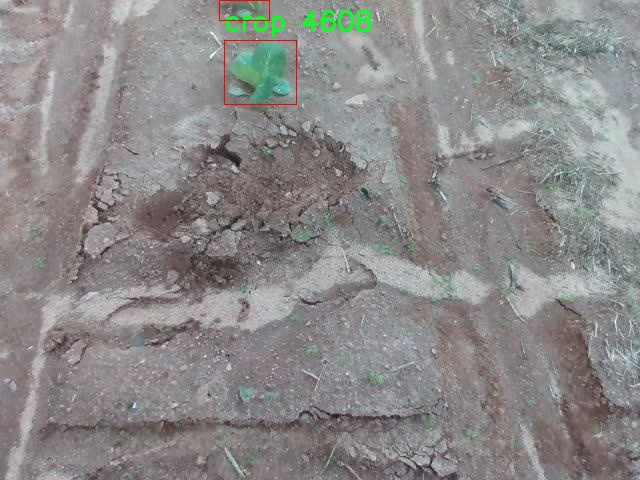
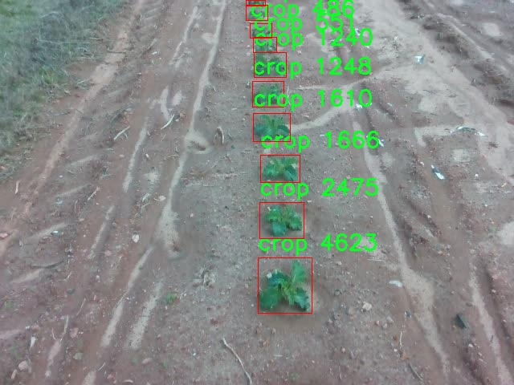

# 农作物检测检测系统源码分享
 # [一条龙教学YOLOV8标注好的数据集一键训练_70+全套改进创新点发刊_Web前端展示]

### 1.研究背景与意义

项目参考[AAAI Association for the Advancement of Artificial Intelligence](https://gitee.com/qunshansj/projects)

项目来源[AACV Association for the Advancement of Computer Vision](https://gitee.com/qunmasj/projects)

研究背景与意义

随着全球人口的不断增长和城市化进程的加快，农业生产面临着前所未有的挑战。如何提高农作物的产量和质量，保障粮食安全，已成为各国政府和科研机构亟待解决的重要课题。在这一背景下，现代农业正逐步向智能化、精准化方向发展，尤其是计算机视觉技术的应用为农作物的监测和管理提供了新的解决方案。近年来，深度学习技术的快速发展，尤其是目标检测算法的不断优化，使得农作物检测的准确性和效率得到了显著提升。

YOLO（You Only Look Once）系列算法因其高效的实时检测能力而受到广泛关注。YOLOv8作为该系列的最新版本，结合了更为先进的网络结构和训练策略，能够在保证检测精度的同时，显著提高处理速度。然而，针对特定领域的应用，尤其是农作物检测，现有的YOLOv8模型仍存在一定的局限性，如对复杂背景的适应性不足、对不同生长阶段作物的识别能力较弱等。因此，基于改进YOLOv8的农作物检测系统的研究具有重要的现实意义。

本研究将以3300张图像的农作物检测数据集为基础，探索如何通过改进YOLOv8模型来提升农作物的检测性能。该数据集包含了单一类别的农作物信息，虽然类别数量较少，但图像数量的丰富性为模型的训练提供了良好的基础。通过对数据集的深入分析，可以识别出不同生长阶段、不同环境条件下作物的特征，从而为模型的改进提供数据支持。

改进YOLOv8模型的研究不仅能够提升农作物的检测精度，还能为农业生产提供实时监测和预警机制，帮助农民及时发现病虫害、缺水等问题，从而采取相应的措施，提高作物的产量和质量。此外，基于改进YOLOv8的农作物检测系统还可以与无人机、智能农业设备等结合，实现自动化的田间管理，推动农业的智能化转型。

在学术研究方面，本研究将为目标检测领域提供新的思路和方法，特别是在特定应用场景下的模型优化与改进。同时，研究成果也将为农业信息化的发展提供理论支持和实践指导，促进农业科技的进步。通过对YOLOv8模型的改进与应用，能够为实现精准农业、可持续发展提供有力的技术保障。

综上所述，基于改进YOLOv8的农作物检测系统的研究，不仅具有重要的学术价值和应用前景，更为推动农业现代化、保障粮食安全提供了切实可行的解决方案。这一研究将为未来的农业生产模式转型提供新的思路，助力实现更高效、更智能的农业管理。

### 2.图片演示







##### 注意：由于此博客编辑较早，上面“2.图片演示”和“3.视频演示”展示的系统图片或者视频可能为老版本，新版本在老版本的基础上升级如下：（实际效果以升级的新版本为准）

  （1）适配了YOLOV8的“目标检测”模型和“实例分割”模型，通过加载相应的权重（.pt）文件即可自适应加载模型。

  （2）支持“图片识别”、“视频识别”、“摄像头实时识别”三种识别模式。

  （3）支持“图片识别”、“视频识别”、“摄像头实时识别”三种识别结果保存导出，解决手动导出（容易卡顿出现爆内存）存在的问题，识别完自动保存结果并导出到tempDir中。

  （4）支持Web前端系统中的标题、背景图等自定义修改，后面提供修改教程。

  另外本项目提供训练的数据集和训练教程,暂不提供权重文件（best.pt）,需要您按照教程进行训练后实现图片演示和Web前端界面演示的效果。

### 3.视频演示

[3.1 视频演示](https://www.bilibili.com/video/BV1Vo4oeLEZN/)

### 4.数据集信息展示

##### 4.1 本项目数据集详细数据（类别数＆类别名）

nc: 1
names: ['crop']


##### 4.2 本项目数据集信息介绍

数据集信息展示

在本研究中，我们采用了名为“crop detection”的数据集，以支持对改进YOLOv8农作物检测系统的训练与评估。该数据集专注于农作物的识别与定位，旨在提升农业领域的智能化管理水平，促进精准农业的发展。数据集的设计充分考虑了农作物在不同生长阶段、不同环境条件下的多样性，以确保模型的泛化能力和实用性。

“crop detection”数据集包含一个类别，即“crop”，这一类别涵盖了多种农作物的图像数据。尽管类别数量较少，但数据集中的图像经过精心挑选，涵盖了多种农作物的生长状态和环境背景。这种单一类别的设计使得模型能够专注于农作物的特征提取与识别，避免了多类别间的干扰，从而提高了检测的准确性和效率。

数据集的构建过程中，研究团队收集了来自不同地区和气候条件下的农作物图像。这些图像不仅包括了农作物在阳光明媚的天气下的表现，还涵盖了阴天、雨天等不同气候条件下的农作物样本。这种多样化的图像来源使得数据集在训练过程中能够模拟真实世界中的各种情况，进而提高模型在实际应用中的鲁棒性。

在数据标注方面，所有图像均经过专业人员的仔细标注，确保每一张图像中的农作物位置准确无误。标注过程采用了高精度的边界框技术，确保模型能够有效地学习到农作物的形状和特征。此外，数据集还包括了一些带有背景干扰的图像，以训练模型在复杂环境下的识别能力。

为了进一步增强数据集的实用性，研究团队还进行了数据增强处理，包括旋转、缩放、翻转等操作。这些增强技术不仅丰富了数据集的多样性，还有效提高了模型的抗干扰能力，使其在面对不同拍摄角度和光照条件时，依然能够保持较高的检测精度。

总的来说，“crop detection”数据集为改进YOLOv8农作物检测系统的训练提供了坚实的基础。通过对单一类别的深入挖掘和多样化的图像收集，该数据集能够有效支持模型在实际农业场景中的应用，助力农作物的智能识别与管理。未来，随着数据集的不断扩展和优化，我们期待能够进一步提升农作物检测系统的性能，为农业生产提供更为精准和高效的技术支持。










### 5.全套项目环境部署视频教程（零基础手把手教学）

[5.1 环境部署教程链接（零基础手把手教学）](https://www.ixigua.com/7404473917358506534?logTag=c807d0cbc21c0ef59de5)


[5.2 安装Python虚拟环境创建和依赖库安装视频教程链接（零基础手把手教学）](https://www.ixigua.com/7404474678003106304?logTag=1f1041108cd1f708b01a)

### 6.手把手YOLOV8训练视频教程（零基础小白有手就能学会）

[6.1 手把手YOLOV8训练视频教程（零基础小白有手就能学会）](https://www.ixigua.com/7404477157818401292?logTag=d31a2dfd1983c9668658)

### 7.70+种全套YOLOV8创新点代码加载调参视频教程（一键加载写好的改进模型的配置文件）

[7.1 70+种全套YOLOV8创新点代码加载调参视频教程（一键加载写好的改进模型的配置文件）](https://www.ixigua.com/7404478314661806627?logTag=29066f8288e3f4eea3a4)

### 8.70+种全套YOLOV8创新点原理讲解（非科班也可以轻松写刊发刊，V10版本正在科研待更新）

由于篇幅限制，每个创新点的具体原理讲解就不一一展开，具体见下列网址中的创新点对应子项目的技术原理博客网址【Blog】：


[8.1 70+种全套YOLOV8创新点原理讲解链接](https://gitee.com/qunmasj/good)

### 9.系统功能展示（检测对象为举例，实际内容以本项目数据集为准）

图9.1.系统支持检测结果表格显示

  图9.2.系统支持置信度和IOU阈值手动调节

  图9.3.系统支持自定义加载权重文件best.pt(需要你通过步骤5中训练获得)

  图9.4.系统支持摄像头实时识别

  图9.5.系统支持图片识别

  图9.6.系统支持视频识别

  图9.7.系统支持识别结果文件自动保存

  图9.8.系统支持Excel导出检测结果数据


### 10.原始YOLOV8算法原理

原始YOLOv8算法原理

YOLOv8（You Only Look Once version 8）是目标检测领域的一项重要进展，代表了YOLO系列算法的最新发展。它在前辈YOLOv5和YOLOv7的基础上，结合了新的设计理念和技术创新，旨在实现更高效、更准确的目标检测。YOLOv8的设计理念围绕着高效性和准确性展开，采用了一系列优化措施，以应对现代计算机视觉任务中日益复杂的需求。

首先，YOLOv8在骨干网络的设计上继续采用跨级结构（Cross Stage Partial, CSP）的思想，这种结构的核心在于通过分离特征流来减少计算复杂度，同时保留重要的特征信息。YOLOv8对YOLOv5中的C3模块进行了优化，替换为更轻量的C2f模块。C2f模块不仅保留了C3模块的优势，还引入了ELAN（Efficient Layer Aggregation Network）思想，通过增加shortcut连接来缓解深层网络中的梯度消失问题，从而提高了模型的训练效率和检测精度。

在特征提取方面，YOLOv8继续使用SPPF（Spatial Pyramid Pooling Fast）模块，这一模块通过多尺度特征的融合，增强了模型对不同大小目标的检测能力。YOLOv8还引入了PAN-FPN（Path Aggregation Network - Feature Pyramid Network）结构，旨在更好地融合来自不同层次的特征信息。通过自下而上的高层特征与中层、浅层特征的融合，YOLOv8能够有效捕捉到目标的细节信息和语义信息，从而提高检测的准确性。

值得注意的是，YOLOv8摒弃了传统的Anchor-Base方法，转而采用Anchor-Free的设计理念。这一变化使得模型在处理不同尺寸和形状的目标时更加灵活，避免了对预定义锚框的依赖，从而简化了模型的训练过程。此外，YOLOv8引入了新的样本匹配策略，将静态匹配改为Task-Aligned的Assigner匹配方式，这一策略能够更好地适应不同任务的需求，提高了样本匹配的效率和准确性。

在损失函数的设计上，YOLOv8使用了变焦损失（VFLLoss）作为分类损失，并结合数据平均保真度损失（DFLLoss）和完美交并比损失（CIoULoss）来计算边界框损失。这种新的损失策略使得YOLOv8在目标检测中能够更准确地定位目标，同时提升了分类的准确性。通过对损失函数的优化，YOLOv8在训练过程中能够更有效地学习到目标的特征，进而提高整体检测性能。

YOLOv8的网络结构依然保持了输入层、主干网络、特征融合层和解耦头的基本框架。输入层负责将图像数据预处理为适合模型输入的格式，主干网络则负责特征提取，特征融合层通过PAN-FPN结构对不同层次的特征进行融合，最后的解耦头则将融合后的特征转换为最终的检测结果。YOLOv8的解耦头部分借鉴了YOLOX和YOLOv6的设计，取消了objectness分支，通过边框回归和目标分类的方式进行目标检测。

在数据预处理方面，YOLOv8采用了YOLOv5的策略，包括马赛克增强、混合增强、空间扰动和颜色扰动等多种增强手段。这些数据增强技术能够有效提升模型的鲁棒性，使其在不同场景下的表现更加稳定。

总的来说，YOLOv8通过一系列的创新和优化，提升了目标检测的效率和准确性。其在特征提取、损失函数、样本匹配等多个方面的改进，使得YOLOv8在处理复杂场景和多样化目标时表现出色。随着YOLOv8的推出，目标检测技术又向前迈进了一步，为各类计算机视觉应用提供了更强大的支持。未来，YOLOv8的设计理念和技术创新将继续影响目标检测领域的发展，推动相关研究的深入与应用的广泛。


### 11.项目核心源码讲解（再也不用担心看不懂代码逻辑）

#### 11.1 ui.py

以下是经过简化和注释的核心代码部分：

```python
import sys
import subprocess
from QtFusion.path import abs_path

def run_script(script_path):
    """
    使用当前 Python 环境运行指定的脚本。

    Args:
        script_path (str): 要运行的脚本路径
    """
    # 获取当前 Python 解释器的路径
    python_path = sys.executable

    # 构建运行命令，使用 streamlit 运行指定的脚本
    command = f'"{python_path}" -m streamlit run "{script_path}"'

    # 执行命令并等待其完成
    result = subprocess.run(command, shell=True)
    
    # 检查命令执行结果，如果返回码不为0，则表示出错
    if result.returncode != 0:
        print("脚本运行出错。")

# 主程序入口
if __name__ == "__main__":
    # 获取要运行的脚本的绝对路径
    script_path = abs_path("web.py")

    # 调用函数运行指定的脚本
    run_script(script_path)
```

### 代码注释说明：
1. **导入模块**：
   - `sys`：用于获取当前 Python 解释器的路径。
   - `subprocess`：用于执行外部命令。
   - `abs_path`：从 `QtFusion.path` 模块导入，用于获取文件的绝对路径。

2. **`run_script` 函数**：
   - 接受一个参数 `script_path`，表示要运行的 Python 脚本的路径。
   - 使用 `sys.executable` 获取当前 Python 解释器的路径。
   - 构建一个命令字符串，使用 `streamlit` 运行指定的脚本。
   - 使用 `subprocess.run` 执行命令，并等待其完成。
   - 检查命令的返回码，如果不为0，打印错误信息。

3. **主程序入口**：
   - 当脚本作为主程序运行时，获取 `web.py` 的绝对路径。
   - 调用 `run_script` 函数来执行该脚本。

这个程序文件名为 `ui.py`，它的主要功能是通过当前的 Python 环境来运行一个指定的脚本，具体是一个名为 `web.py` 的文件。代码中首先导入了必要的模块，包括 `sys`、`os` 和 `subprocess`，以及一个自定义的函数 `abs_path`，该函数用于获取文件的绝对路径。

在 `run_script` 函数中，程序接收一个参数 `script_path`，这是要运行的脚本的路径。函数内部首先获取当前 Python 解释器的路径，接着构建一个命令字符串，这个命令是用来通过 `streamlit` 来运行指定的脚本。`streamlit` 是一个用于构建数据应用的库，通常用于快速创建交互式的网页应用。

随后，使用 `subprocess.run` 方法执行构建好的命令。这个方法会在一个新的子进程中运行命令，并等待其完成。如果脚本运行的返回码不为零，表示运行过程中出现了错误，程序会打印出“脚本运行出错”的提示。

在文件的最后部分，使用 `if __name__ == "__main__":` 这一条件判断来确保当这个文件作为主程序运行时，下面的代码才会被执行。在这里，程序指定了要运行的脚本路径，即 `web.py`，并调用 `run_script` 函数来执行这个脚本。

总的来说，这个文件的作用是为 `web.py` 提供一个运行环境，使得用户可以方便地通过 `ui.py` 来启动这个数据应用。

#### 11.2 70+种YOLOv8算法改进源码大全和调试加载训练教程（非必要）\ultralytics\nn\extra_modules\ops_dcnv3\test.py

以下是经过简化并添加详细中文注释的核心代码部分：

```python
import torch
from functions.dcnv3_func import DCNv3Function, dcnv3_core_pytorch

# 输入和输出的尺寸
H_in, W_in = 8, 8  # 输入图像的高度和宽度
N, M, D = 2, 4, 16  # N为批量大小，M为通道数，D为特征维度
Kh, Kw = 3, 3  # 卷积核的高度和宽度
remove_center = False  # 是否移除中心点
P = Kh * Kw - remove_center  # 卷积核的有效点数
offset_scale = 2.0  # 偏移缩放因子
pad = 1  # 填充
dilation = 1  # 膨胀
stride = 1  # 步幅
# 计算输出的高度和宽度
H_out = (H_in + 2 * pad - (dilation * (Kh - 1) + 1)) // stride + 1
W_out = (W_in + 2 * pad - (dilation * (Kw - 1) + 1)) // stride + 1

torch.manual_seed(3)  # 设置随机种子以确保可重复性

@torch.no_grad()
def check_forward_equal_with_pytorch_double():
    # 生成随机输入、偏移和掩码
    input = torch.rand(N, H_in, W_in, M*D).cuda() * 0.01
    offset = torch.rand(N, H_out, W_out, M*P*2).cuda() * 10
    mask = torch.rand(N, H_out, W_out, M, P).cuda() + 1e-5
    mask /= mask.sum(-1, keepdim=True)  # 归一化掩码
    mask = mask.reshape(N, H_out, W_out, M*P)

    # 使用PyTorch的核心函数计算输出
    output_pytorch = dcnv3_core_pytorch(
        input.double(),
        offset.double(),
        mask.double(),
        Kh, Kw, stride, stride, Kh // 2, Kw // 2, dilation, dilation, M, D, offset_scale, remove_center).detach().cpu()

    # 使用自定义的DCNv3函数计算输出
    output_cuda = DCNv3Function.apply(
        input.double(),
        offset.double(),
        mask.double(),
        Kh, Kw, stride, stride, Kh // 2, Kw // 2, dilation, dilation, M, D, offset_scale,
        im2col_step=2, remove_center).detach().cpu()

    # 检查两个输出是否相近
    fwdok = torch.allclose(output_cuda, output_pytorch)
    max_abs_err = (output_cuda - output_pytorch).abs().max()  # 最大绝对误差
    max_rel_err = ((output_cuda - output_pytorch).abs() / output_pytorch.abs()).max()  # 最大相对误差
    print('>>> forward double')
    print(f'* {fwdok} check_forward_equal_with_pytorch_double: max_abs_err {max_abs_err:.2e} max_rel_err {max_rel_err:.2e}')

if __name__ == '__main__':
    check_forward_equal_with_pytorch_double()  # 调用前向一致性检查函数
```

### 代码注释说明：
1. **输入输出参数**：定义了输入图像的尺寸、批量大小、通道数和特征维度等。
2. **计算输出尺寸**：根据输入尺寸、卷积核、填充、步幅等参数计算输出的高度和宽度。
3. **随机输入生成**：使用`torch.rand`生成随机的输入、偏移和掩码，并进行归一化处理。
4. **前向计算**：分别调用PyTorch的核心函数和自定义的DCNv3函数进行前向计算，并将结果从GPU转移到CPU。
5. **误差检查**：通过`torch.allclose`检查两个输出是否相近，并计算最大绝对误差和最大相对误差，输出结果。

该代码的核心功能是实现对自定义DCNv3函数的前向计算与PyTorch内置函数的结果进行一致性验证。

这个程序文件是一个用于测试和验证深度学习中DCNv3（Deformable Convolutional Networks v3）功能的脚本。它主要通过与PyTorch的标准实现进行比较，确保自定义的DCNv3实现的正确性和性能。

首先，文件导入了一些必要的库，包括PyTorch和一些数学函数。接着，定义了一些参数，如输入和输出的高度和宽度、通道数、卷积核的大小、步幅、填充等。这些参数用于构建测试用的输入数据。

接下来的几个函数主要用于验证DCNv3的前向和反向传播的正确性。`check_forward_equal_with_pytorch_double`和`check_forward_equal_with_pytorch_float`函数分别使用双精度和单精度浮点数生成随机输入、偏移量和掩码，并计算DCNv3的输出。它们通过比较自定义实现与PyTorch标准实现的输出，检查它们是否相近，并输出最大绝对误差和相对误差。

类似地，`check_backward_equal_with_pytorch_double`和`check_backward_equal_with_pytorch_float`函数则是用于验证反向传播的正确性。它们生成输入数据并计算梯度，然后比较自定义实现和PyTorch标准实现的梯度，确保它们的一致性。

最后，`check_time_cost`函数用于测试DCNv3的执行时间。它生成一定规模的输入数据，并重复调用DCNv3的前向传播函数，计算平均执行时间，以评估性能。

在主程序中，依次调用这些检查函数，确保DCNv3的实现既正确又高效。整体上，这个文件是一个全面的测试脚本，旨在验证和评估DCNv3在深度学习框架中的实现。

#### 11.3 70+种YOLOv8算法改进源码大全和调试加载训练教程（非必要）\ultralytics\models\yolo\model.py

```python
# 导入所需的模块和类
from ultralytics.engine.model import Model
from ultralytics.models import yolo  # noqa
from ultralytics.nn.tasks import ClassificationModel, DetectionModel, PoseModel, SegmentationModel

class YOLO(Model):
    """YOLO (You Only Look Once) 目标检测模型的定义。"""

    @property
    def task_map(self):
        """将任务类型映射到相应的模型、训练器、验证器和预测器类。"""
        return {
            'classify': {  # 分类任务
                'model': ClassificationModel,  # 分类模型
                'trainer': yolo.classify.ClassificationTrainer,  # 分类训练器
                'validator': yolo.classify.ClassificationValidator,  # 分类验证器
                'predictor': yolo.classify.ClassificationPredictor,  # 分类预测器
            },
            'detect': {  # 检测任务
                'model': DetectionModel,  # 检测模型
                'trainer': yolo.detect.DetectionTrainer,  # 检测训练器
                'validator': yolo.detect.DetectionValidator,  # 检测验证器
                'predictor': yolo.detect.DetectionPredictor,  # 检测预测器
            },
            'segment': {  # 分割任务
                'model': SegmentationModel,  # 分割模型
                'trainer': yolo.segment.SegmentationTrainer,  # 分割训练器
                'validator': yolo.segment.SegmentationValidator,  # 分割验证器
                'predictor': yolo.segment.SegmentationPredictor,  # 分割预测器
            },
            'pose': {  # 姿态估计任务
                'model': PoseModel,  # 姿态模型
                'trainer': yolo.pose.PoseTrainer,  # 姿态训练器
                'validator': yolo.pose.PoseValidator,  # 姿态验证器
                'predictor': yolo.pose.PosePredictor,  # 姿态预测器
            },
        }
```

### 代码核心部分及注释说明：

1. **导入模块**：
   - 从 `ultralytics.engine.model` 导入 `Model` 类，作为 YOLO 模型的基类。
   - 从 `ultralytics.models` 导入 `yolo` 模块。
   - 从 `ultralytics.nn.tasks` 导入各类任务模型（分类、检测、分割、姿态估计）。

2. **YOLO 类**：
   - 继承自 `Model` 类，表示 YOLO 目标检测模型。

3. **task_map 属性**：
   - 该属性返回一个字典，映射不同的任务类型（如分类、检测、分割、姿态估计）到相应的模型、训练器、验证器和预测器。
   - 每个任务类型都有四个关键部分：
     - `model`：对应的模型类。
     - `trainer`：用于训练的类。
     - `validator`：用于验证的类。
     - `predictor`：用于预测的类。

通过这个映射，YOLO 类能够根据不同的任务类型动态选择相应的处理方式。

该程序文件是Ultralytics YOLO（You Only Look Once）对象检测模型的实现部分，遵循AGPL-3.0许可证。文件中主要定义了一个名为`YOLO`的类，该类继承自`Model`类，表示YOLO对象检测模型。

在`YOLO`类中，有一个名为`task_map`的属性方法。这个方法的作用是将不同的任务类型（如分类、检测、分割和姿态估计）映射到相应的模型、训练器、验证器和预测器类。具体来说，`task_map`返回一个字典，其中每个任务类型作为键，对应的值又是一个字典，包含以下四个部分：

1. `model`：对应的模型类，例如分类任务对应`ClassificationModel`，检测任务对应`DetectionModel`，分割任务对应`SegmentationModel`，姿态估计任务对应`PoseModel`。
2. `trainer`：对应的训练器类，用于训练模型。
3. `validator`：对应的验证器类，用于验证模型的性能。
4. `predictor`：对应的预测器类，用于进行推理和预测。

这种设计使得YOLO模型能够灵活地处理不同的计算机视觉任务，便于扩展和维护。通过这种结构，用户可以根据需要选择合适的模型和相关工具来完成特定的任务。整体上，该文件为YOLO模型的多任务处理提供了清晰的框架和接口。

#### 11.4 train.py

以下是经过简化和注释的核心代码部分，主要集中在 YOLO 检测模型的训练过程中：

```python
import random
import numpy as np
import torch.nn as nn
from ultralytics.data import build_dataloader, build_yolo_dataset
from ultralytics.engine.trainer import BaseTrainer
from ultralytics.models import yolo
from ultralytics.nn.tasks import DetectionModel
from ultralytics.utils import LOGGER, RANK
from ultralytics.utils.torch_utils import de_parallel, torch_distributed_zero_first

class DetectionTrainer(BaseTrainer):
    """
    扩展 BaseTrainer 类的检测模型训练类。
    """

    def build_dataset(self, img_path, mode="train", batch=None):
        """
        构建 YOLO 数据集。

        参数:
            img_path (str): 包含图像的文件夹路径。
            mode (str): 模式，可以是 'train' 或 'val'，用于不同的数据增强。
            batch (int, optional): 批次大小，默认为 None。
        """
        gs = max(int(de_parallel(self.model).stride.max() if self.model else 0), 32)
        return build_yolo_dataset(self.args, img_path, batch, self.data, mode=mode, rect=mode == "val", stride=gs)

    def get_dataloader(self, dataset_path, batch_size=16, rank=0, mode="train"):
        """构造并返回数据加载器。"""
        assert mode in ["train", "val"]
        with torch_distributed_zero_first(rank):  # DDP模式下只初始化一次数据集
            dataset = self.build_dataset(dataset_path, mode, batch_size)
        shuffle = mode == "train"  # 训练模式下打乱数据
        workers = self.args.workers if mode == "train" else self.args.workers * 2
        return build_dataloader(dataset, batch_size, workers, shuffle, rank)  # 返回数据加载器

    def preprocess_batch(self, batch):
        """对图像批次进行预处理，包括缩放和转换为浮点数。"""
        batch["img"] = batch["img"].to(self.device, non_blocking=True).float() / 255  # 归一化到 [0, 1]
        if self.args.multi_scale:  # 如果启用多尺度训练
            imgs = batch["img"]
            sz = (
                random.randrange(self.args.imgsz * 0.5, self.args.imgsz * 1.5 + self.stride)
                // self.stride
                * self.stride
            )  # 随机选择新的尺寸
            sf = sz / max(imgs.shape[2:])  # 计算缩放因子
            if sf != 1:
                ns = [
                    math.ceil(x * sf / self.stride) * self.stride for x in imgs.shape[2:]
                ]  # 计算新的形状
                imgs = nn.functional.interpolate(imgs, size=ns, mode="bilinear", align_corners=False)  # 进行插值
            batch["img"] = imgs
        return batch

    def get_model(self, cfg=None, weights=None, verbose=True):
        """返回 YOLO 检测模型。"""
        model = DetectionModel(cfg, nc=self.data["nc"], verbose=verbose and RANK == -1)
        if weights:
            model.load(weights)  # 加载预训练权重
        return model

    def plot_training_samples(self, batch, ni):
        """绘制训练样本及其标注。"""
        plot_images(
            images=batch["img"],
            batch_idx=batch["batch_idx"],
            cls=batch["cls"].squeeze(-1),
            bboxes=batch["bboxes"],
            paths=batch["im_file"],
            fname=self.save_dir / f"train_batch{ni}.jpg",
            on_plot=self.on_plot,
        )

    def plot_metrics(self):
        """从 CSV 文件中绘制指标。"""
        plot_results(file=self.csv, on_plot=self.on_plot)  # 保存结果图
```

### 代码说明：
1. **构建数据集**：`build_dataset` 方法用于根据给定的图像路径和模式（训练或验证）构建 YOLO 数据集。
2. **获取数据加载器**：`get_dataloader` 方法用于创建数据加载器，支持分布式训练并根据模式决定是否打乱数据。
3. **预处理批次**：`preprocess_batch` 方法负责对输入图像进行归一化和可能的多尺度调整。
4. **获取模型**：`get_model` 方法用于实例化 YOLO 检测模型，并可选择加载预训练权重。
5. **绘制训练样本**：`plot_training_samples` 方法用于可视化训练样本及其对应的标注信息。
6. **绘制指标**：`plot_metrics` 方法用于从 CSV 文件中绘制训练过程中的指标，便于分析模型性能。

这个程序文件 `train.py` 是一个用于训练目标检测模型的脚本，主要基于 YOLO（You Only Look Once）模型。文件中包含了一个名为 `DetectionTrainer` 的类，该类继承自 `BaseTrainer`，用于实现目标检测的训练过程。

在类的构造中，首先定义了一个 `build_dataset` 方法，该方法用于构建 YOLO 数据集。它接收图像路径、模式（训练或验证）和批次大小作为参数。通过调用 `build_yolo_dataset` 函数，构建相应的数据集，并根据模型的步幅设置合适的参数。

接下来，`get_dataloader` 方法用于构建数据加载器。它会根据传入的模式（训练或验证）来初始化数据集，并设置是否打乱数据的顺序。该方法还会根据训练模式的不同，调整工作线程的数量。

`preprocess_batch` 方法用于对输入的图像批次进行预处理，包括将图像缩放到适当的大小并转换为浮点数格式。该方法还支持多尺度训练，通过随机选择图像的大小来增强模型的鲁棒性。

`set_model_attributes` 方法用于设置模型的属性，包括类别数量和类别名称。这些信息会被附加到模型中，以便在训练过程中使用。

`get_model` 方法返回一个 YOLO 检测模型的实例，可以选择加载预训练的权重。

`get_validator` 方法返回一个用于模型验证的 `DetectionValidator` 实例，以便在训练后对模型进行评估。

`label_loss_items` 方法用于返回带有标签的训练损失项字典，便于在训练过程中监控模型的性能。

`progress_string` 方法返回一个格式化的字符串，显示训练进度，包括当前的 epoch、GPU 内存使用情况、损失值、实例数量和图像大小等信息。

`plot_training_samples` 方法用于绘制训练样本及其注释，以便可视化训练过程中的数据。

最后，`plot_metrics` 和 `plot_training_labels` 方法分别用于绘制训练过程中的指标和创建带标签的训练图，以便更好地理解模型的学习情况。

整体而言，这个文件提供了一个完整的框架，用于构建、训练和评估 YOLO 目标检测模型，涵盖了数据处理、模型设置、训练监控和结果可视化等多个方面。

#### 11.5 code\ui.py

以下是保留的核心代码部分，并添加了详细的中文注释：

```python
import sys
import subprocess

def run_script(script_path):
    """
    使用当前 Python 环境运行指定的脚本。

    Args:
        script_path (str): 要运行的脚本路径

    Returns:
        None
    """
    # 获取当前 Python 解释器的路径
    python_path = sys.executable

    # 构建运行命令，使用 streamlit 运行指定的脚本
    command = f'"{python_path}" -m streamlit run "{script_path}"'

    # 执行命令，shell=True 允许在 shell 中执行命令
    result = subprocess.run(command, shell=True)
    
    # 检查命令执行结果，如果返回码不为 0，表示执行出错
    if result.returncode != 0:
        print("脚本运行出错。")

# 主程序入口
if __name__ == "__main__":
    # 指定要运行的脚本路径
    script_path = "web.py"  # 假设脚本在当前目录下

    # 调用函数运行指定的脚本
    run_script(script_path)
```

### 代码注释说明：
1. **导入模块**：
   - `sys`：用于访问与 Python 解释器紧密相关的变量和函数。
   - `subprocess`：用于生成新进程、连接到它们的输入/输出/错误管道，并获得它们的返回码。

2. **run_script 函数**：
   - 接受一个参数 `script_path`，表示要运行的 Python 脚本的路径。
   - 使用 `sys.executable` 获取当前 Python 解释器的路径，以确保在正确的环境中运行脚本。
   - 构建命令字符串，使用 `streamlit` 模块运行指定的脚本。
   - 使用 `subprocess.run` 执行命令，并检查返回码以判断脚本是否成功运行。

3. **主程序入口**：
   - 在 `__main__` 块中，指定要运行的脚本路径，并调用 `run_script` 函数执行该脚本。

这个程序文件 `ui.py` 的主要功能是使用当前的 Python 环境来运行一个指定的脚本，具体是通过 Streamlit 框架来启动一个 Web 应用。

首先，程序导入了必要的模块，包括 `sys`、`os` 和 `subprocess`。其中，`sys` 模块用于访问与 Python 解释器相关的变量和函数，`os` 模块提供了与操作系统交互的功能，而 `subprocess` 模块则用于执行外部命令。

接下来，程序从 `QtFusion.path` 模块中导入了 `abs_path` 函数，这个函数的作用是获取给定路径的绝对路径。

在 `run_script` 函数中，程序接受一个参数 `script_path`，表示要运行的脚本的路径。函数内部首先获取当前 Python 解释器的路径，存储在 `python_path` 变量中。然后，构建一个命令字符串 `command`，这个命令用于调用 Streamlit 来运行指定的脚本。命令的格式是 `"{python_path}" -m streamlit run "{script_path}"`，其中 `-m` 选项表示以模块的方式运行。

接着，程序使用 `subprocess.run` 方法来执行这个命令，`shell=True` 参数允许在 shell 中执行命令。执行完命令后，程序检查返回的结果，如果返回码不为 0，表示脚本运行出错，此时会打印出错误信息。

在文件的最后部分，程序通过 `if __name__ == "__main__":` 语句来判断是否是直接运行该脚本。如果是，程序会调用 `abs_path` 函数来获取 `web.py` 脚本的绝对路径，并将其传递给 `run_script` 函数，从而启动该脚本。

总的来说，这个程序的功能是方便地启动一个 Streamlit Web 应用，确保在当前 Python 环境中运行指定的脚本。

#### 11.6 code\ultralytics\models\sam\modules\transformer.py

以下是代码中最核心的部分，并附上详细的中文注释：

```python
import math
import torch
from torch import Tensor, nn

class Attention(nn.Module):
    """注意力层，允许在投影到查询、键和值后对嵌入大小进行下采样。"""

    def __init__(self, embedding_dim: int, num_heads: int, downsample_rate: int = 1) -> None:
        """
        初始化注意力模型，设置嵌入维度和头数。

        Args:
            embedding_dim (int): 输入嵌入的维度。
            num_heads (int): 注意力头的数量。
            downsample_rate (int, optional): 内部维度下采样的因子，默认为1。
        """
        super().__init__()
        self.embedding_dim = embedding_dim
        self.internal_dim = embedding_dim // downsample_rate  # 计算内部维度
        self.num_heads = num_heads
        assert self.internal_dim % num_heads == 0, "num_heads必须能够整除embedding_dim."

        # 定义线性层用于查询、键和值的投影
        self.q_proj = nn.Linear(embedding_dim, self.internal_dim)
        self.k_proj = nn.Linear(embedding_dim, self.internal_dim)
        self.v_proj = nn.Linear(embedding_dim, self.internal_dim)
        self.out_proj = nn.Linear(self.internal_dim, embedding_dim)  # 输出投影层

    @staticmethod
    def _separate_heads(x: Tensor, num_heads: int) -> Tensor:
        """将输入张量分离成指定数量的注意力头。"""
        b, n, c = x.shape  # b: 批量大小, n: 序列长度, c: 特征维度
        x = x.reshape(b, n, num_heads, c // num_heads)  # 重塑张量以分离头
        return x.transpose(1, 2)  # 变换维度为 B x N_heads x N_tokens x C_per_head

    @staticmethod
    def _recombine_heads(x: Tensor) -> Tensor:
        """将分离的注意力头重新组合成单个张量。"""
        b, n_heads, n_tokens, c_per_head = x.shape
        x = x.transpose(1, 2)  # 变换维度
        return x.reshape(b, n_tokens, n_heads * c_per_head)  # B x N_tokens x C

    def forward(self, q: Tensor, k: Tensor, v: Tensor) -> Tensor:
        """根据输入的查询、键和值张量计算注意力输出。"""

        # 输入投影
        q = self.q_proj(q)  # 查询投影
        k = self.k_proj(k)  # 键投影
        v = self.v_proj(v)  # 值投影

        # 分离成多个头
        q = self._separate_heads(q, self.num_heads)
        k = self._separate_heads(k, self.num_heads)
        v = self._separate_heads(v, self.num_heads)

        # 计算注意力
        _, _, _, c_per_head = q.shape
        attn = q @ k.permute(0, 1, 3, 2)  # 计算注意力得分
        attn = attn / math.sqrt(c_per_head)  # 缩放
        attn = torch.softmax(attn, dim=-1)  # 应用softmax以获得注意力权重

        # 获取输出
        out = attn @ v  # 加权求和
        out = self._recombine_heads(out)  # 重新组合头
        return self.out_proj(out)  # 输出投影
```

### 代码说明：
1. **Attention类**：实现了一个注意力机制，允许对输入的查询、键和值进行处理，并可以选择性地对内部维度进行下采样。
2. **初始化方法**：定义了输入嵌入的维度、注意力头的数量以及可选的下采样率，并创建了用于查询、键和值的线性投影层。
3. **_separate_heads和_recombine_heads方法**：这两个静态方法用于将输入张量分离成多个注意力头和将它们重新组合，便于并行计算。
4. **forward方法**：实现了注意力机制的核心计算，包括查询、键和值的投影、注意力得分的计算、应用softmax以获得注意力权重，并返回加权后的输出。

这个注意力机制是现代深度学习模型（如Transformer）中非常重要的组成部分，广泛应用于自然语言处理和计算机视觉等领域。

这个程序文件定义了一个名为 `TwoWayTransformer` 的神经网络模块，主要用于处理图像和查询点之间的注意力机制，适用于目标检测、图像分割和点云处理等任务。它是一个特殊的变换器解码器，能够同时关注输入图像和查询点。

在 `TwoWayTransformer` 类的构造函数中，初始化了一些重要的参数，包括变换器的层数（`depth`）、输入嵌入的通道维度（`embedding_dim`）、多头注意力的头数（`num_heads`）、MLP块的内部通道维度（`mlp_dim`）等。接着，创建了一个包含多个 `TwoWayAttentionBlock` 层的模块列表，每个层都执行自注意力和交叉注意力操作。最后，定义了一个最终的注意力层和一个层归一化层，用于处理最终的查询。

在 `forward` 方法中，首先将输入的图像嵌入和位置编码展平并调整维度，以便进行后续处理。然后，准备查询和键，依次通过每个变换器层进行处理。最后，应用最终的注意力层，将查询和图像嵌入结合，并进行层归一化，返回处理后的查询和键。

`TwoWayAttentionBlock` 类实现了一个注意力块，执行自注意力和交叉注意力，分为四个主要部分：对稀疏输入的自注意力、稀疏输入到密集输入的交叉注意力、稀疏输入的MLP块以及密集输入到稀疏输入的交叉注意力。每个部分后面都跟有层归一化，以提高模型的稳定性和性能。

`Attention` 类则实现了一个注意力层，允许在投影到查询、键和值之后对嵌入的大小进行下采样。它包含输入投影的线性层，并提供了将输入张量分离成多个注意力头和重新组合的静态方法。在 `forward` 方法中，首先对输入进行投影，然后将其分离成多个头，计算注意力分数，最后得到输出。

整体而言，这个程序文件实现了一个复杂的变换器结构，结合了多头注意力机制和MLP块，能够有效地处理图像和查询点之间的关系，适用于多种计算机视觉任务。

### 12.系统整体结构（节选）

### 整体功能和构架概括

该项目主要围绕YOLO（You Only Look Once）系列目标检测算法及其改进实现，包含多个模块和文件，涵盖模型定义、训练、测试、数据处理和用户界面等功能。项目的核心是YOLOv8模型，支持多种计算机视觉任务，如目标检测、图像分割和姿态估计。通过使用Transformer结构和注意力机制，项目实现了高效的特征提取和信息处理。

以下是项目中各个文件的功能概述：

| 文件路径                                                                                             | 功能描述                                                                                          |
|------------------------------------------------------------------------------------------------------|---------------------------------------------------------------------------------------------------|
| `code/ui.py`                                                                                         | 提供一个用户界面，通过Streamlit框架运行指定的YOLO脚本。                                          |
| `ultralytics/nn/extra_modules/ops_dcnv3/test.py`                                                  | 测试DCNv3（Deformable Convolutional Networks v3）的前向和反向传播的正确性及性能。                 |
| `ultralytics/models/yolo/model.py`                                                                  | 定义YOLO模型的类及其任务映射，支持多种计算机视觉任务（如分类、检测、分割）。                    |
| `train.py`                                                                                          | 实现YOLO目标检测模型的训练过程，包括数据集构建、模型设置、训练监控和结果可视化。               |
| `code/ultralytics/models/sam/modules/transformer.py`                                               | 实现双向变换器结构，结合多头注意力机制，处理图像和查询点之间的关系。                            |
| `ultralytics/nn/backbone/efficientViT.py`                                                          | 定义EfficientViT（高效视觉变换器）作为YOLO模型的骨干网络，优化特征提取过程。                   |
| `ultralytics/trackers/utils/gmc.py`                                                                | 实现全局运动补偿（Global Motion Compensation）功能，支持视频目标跟踪。                          |
| `code/ultralytics/utils/tal.py`                                                                     | 提供与目标检测和跟踪相关的实用工具和辅助函数。                                                  |
| `code/ultralytics/utils/callbacks/base.py`                                                          | 定义训练过程中的回调函数基类，支持自定义训练过程中的行为。                                      |
| `ultralytics/models/yolo/segment/train.py`                                                         | 实现YOLO模型的图像分割训练过程，支持分割任务的训练和评估。                                     |
| `code/ultralytics/trackers/utils/matching.py`                                                      | 实现目标匹配算法，支持目标跟踪中的数据关联。                                                    |
| `code/ultralytics/solutions/ai_gym.py`                                                             | 提供AI训练和测试环境的解决方案，支持模型的评估和优化。                                          |

该项目通过模块化设计，使得不同功能的实现相对独立，便于维护和扩展，同时也为用户提供了灵活的接口来进行模型训练、测试和应用。

注意：由于此博客编辑较早，上面“11.项目核心源码讲解（再也不用担心看不懂代码逻辑）”中部分代码可能会优化升级，仅供参考学习，完整“训练源码”、“Web前端界面”和“70+种创新点源码”以“13.完整训练+Web前端界面+70+种创新点源码、数据集获取”的内容为准。

### 13.完整训练+Web前端界面+70+种创新点源码、数据集获取


# [下载链接：https://mbd.pub/o/bread/ZpuVkp5u](https://mbd.pub/o/bread/ZpuVkp5u)